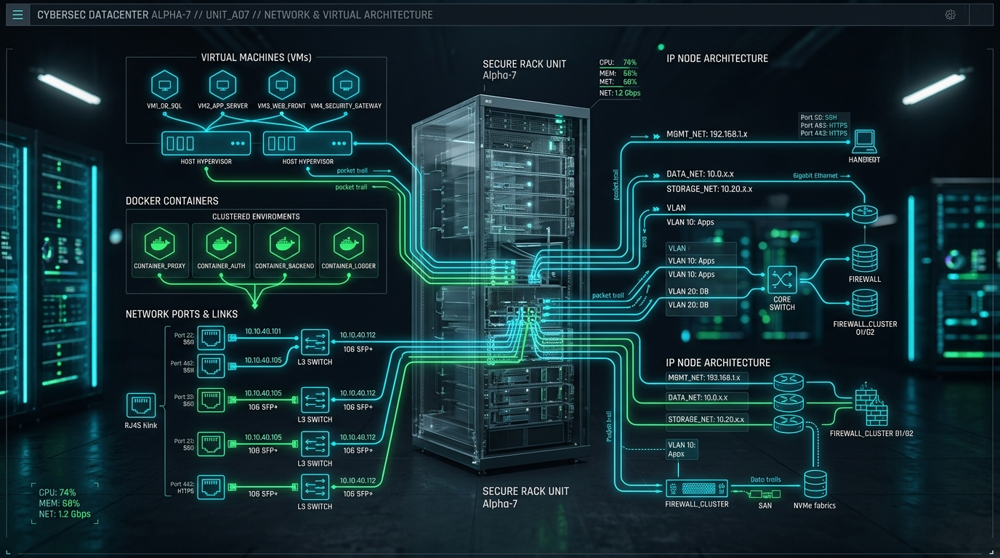
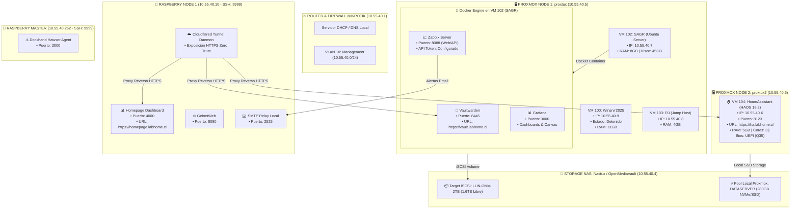

# 🎛️ Diagramas 3D de Arquitectura e Infraestructura de Rack: LabHome 3D

Este documento contiene los **dos esquemas 3D completos** del rack de **LabHome 3D**:
1. **Diagrama 1 (Macro):** Mapa físico y conexionado de puertos (apto para publicación pública, sin direcciones IP).
2. **Diagrama 2 (Micro):** Especificación ultra-detallada interna (con direcciones IP, puertos de servicio, IDs de máquinas virtuales, contenedores Docker y volúmenes de almacenamiento).

---

## 🌐 1. Diagrama 1: Macro Arquitectura 3D y Conexionado de Rack (Público)

Este esquema representa la distribución física en el gabinete de rack (U1 a U12), la jerarquía de red y la función de cada cable de interconexión.


### 📐 Mapa Físico del Gabinete por Unidades de Rack (RU)

```mermaid
graph TD
    subgraph RACK["🗄️ GABINETE RACK 19\" (LabHome 3D)"]
        direction TB
        U01["U01 - 🔌 PDU / Distribución de Energía PDU-01"]
        U02["U02 - ⚡ UPS Respaldado (Onduladora de Respaldo)"]
        U03["U03 - 🌐 Firewall Router MikroTik (WAN / Gateway Main)"]
        U04["U04 - 🔀 Switch MikroTik Core (10GbE SFP+ Trunk)"]
        U05["U05 - 🔀 Switch TP-Link (24 Puertos PoE / Acceso LAN)"]
        U06["U06 - 🗂️ Patch Panel Cat6 (24 Puertos RACK-PP1)"]
        U07["U07 - 🖥️ Servidor Proxmox Node 1 ('proxtux' - 1U)"]
        U08["U08 - 🖥️ Servidor Proxmox Node 2 ('proxtux2' - 1U)"]
        U09["U09 - 💾 NAS OpenMediaVault ('Nastux' - Array Discos)"]
        U10["U10 - 🍓 Cluster Tray Raspberry Pi (Node 1 & Master)"]
    end
```

### 🔌 Cableado y Conexiones de Puerto a Puerto (Macro)

| Origen (Puerto) | Destino (Puerto) | Tipo de Cable | Función / Tráfico |
| :--- | :--- | :--- | :--- |
| **Ont ISP / Modem** | **MikroTik Firewall (Port 1)** | Cat6 UTP (Rojo) | Enlace WAN principal a Internet |
| **MikroTik Firewall (Port 2)** | **Switch MikroTik Core (SFP+ 1)** | 10G DAC Cable | Troncal Gateway LAN principal |
| **Switch MikroTik Core (Port 1)** | **Proxmox Node 1 (Eth0)** | Cat6 UTP (Azul) | Red de Gestión e Hipervisor Node 1 |
| **Switch MikroTik Core (Port 2)** | **Proxmox Node 2 (Eth0)** | Cat6 UTP (Azul) | Red de Gestión e Hipervisor Node 2 |
| **Switch MikroTik Core (Port 3)** | **NAS Nastux (Eth0)** | Cat6 UTP (Verde) | Enlace SAN / iSCSI de Alta Velocidad |
| **Switch MikroTik Core (Port 4)** | **NAS Nastux (Eth1)** | Cat6 UTP (Verde) | Enlace NAS Datos / Compartidos |
| **Switch TP-Link (Port 1)** | **Raspberry Node 1 (Eth0)** | Cat6 UTP (Amarillo) | Servidor Web Dashboard / Proxy |
| **Switch TP-Link (Port 2)** | **Raspberry Master (Eth0)** | Cat6 UTP (Amarillo) | Agente de Gestión Dockhand |
| **Switch TP-Link (SFP+ 1)** | **Switch MikroTik Core (SFP+ 2)** | 10G DAC Cable | Enlace de Interconexión entre Switches |

---

## 🔍 2. Diagrama 2: Micro Arquitectura 3D y Especificación Interna (Ultra Detallado)

Este mapa técnico desglosa la infraestructura completa: direcciones IP, subredes, identificadores de máquinas virtuales (VMID), puertos de contenedores Docker, almacenamiento iSCSI y túneles de exposición.



### 🧠 Diagrama de Flujo Técnico Completo (IPs, VMs, Docker, Puertos)



---

### 📋 Inventario Ultra-Detallado por Periférico y Recursos

| Periférico / Nodo | IP / Puerto SSH | Componente / VM / Docker | ID / Puerto Servicio | Almacenamiento / Notas |
| :--- | :--- | :--- | :--- | :--- |
| **Proxmox Node 1 (`proxtux`)** | `10.55.40.5:22` | **VM 100 (Winsrvr2025)** | VMID `100` | 100 GB Disk (Detenido) |
| | | **VM 102 (SAGR)** | VMID `102` | 45 GB Disk (Ubuntu 24.04 LTS) |
| | | ├─ Container `vaultwarden` | `8445` -> HTTPS `vault.labhome.cl` | Data: `/DOCKER-DATA/vaultwarden` |
| | | ├─ Container `zabbix-server` | `8088` (API / Web) | Database: MySQL Zabbix |
| | | └─ Container `grafana` | `3000` | Dashboards, Canvas, Zabbix Datasource |
| | | **VM 103 (RJ)** | VMID `103` | 32 GB Disk (Jump Server) |
| **Proxmox Node 2 (`proxtux2`)** | `10.55.40.6:22` | **VM 104 (HomeAssistant)** | VMID `104` | 32 GB en `DATASERVER` (HAOS 18.2 UEFI) |
| **OpenMediaVault (`Nastux`)** | `10.55.40.4:22` | **Storage Targets** | iSCSI / LVM | `LUN-OMV-2TB` (1.6TB Libre) |
| **Raspberry (`Rasp_Node_1`)** | `10.55.40.10:9999` | **Homepage Dashboard** | `4000` | Config: `/DOCKER-DATA/homepage` |
| | | **GeinetWeb** | `8080` | Config: `/DOCKER-DATA/geinetweb` |
| | | **SMTP Relay Local** | `2525` | Relay sin auth hacia Gmail |
| | | **Cloudflared Daemon** | Tunnel Active | Túnel Zero Trust (`labhome.cl`) |
| **Raspberry (`Rasp_Node_Master`)** | `10.55.40.252:9999` | **Dockhand Hawser** | `3000` | Agente gestor de Docker |
